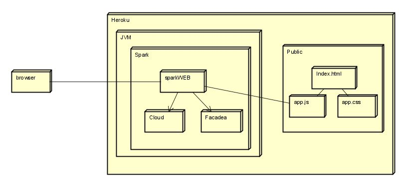

# Spark Web

### Despliegue Heroku API Client(Java)

### Despliegue Heroku Web Client(JavaScript)

### GitHub Web Client

https://github.com/julitom1/frontSpark

## Descripción

## Diseño

### Diagrama de Clases

### Diagrama de Despliegue

## Memoria Cache

Son HashMapConcurrent que mantienen un dato guardado durante 5 minutos, después de haberlo pedido a la API externa, pasado los 5 minutos lo eliminan

## Extensibilidad

## Autor

 * Yarit Yajanny Villalobos
