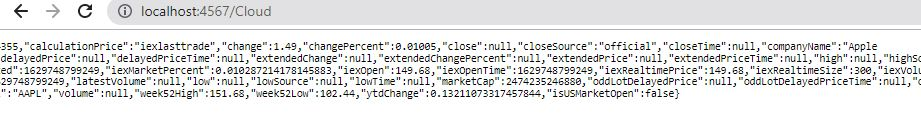

# Spark Web

### Despliegue Heroku API Client(Java)

### Despliegue Heroku Web Client(JavaScript)

### GitHub Web Client

https://github.com/julitom1/frontSpark

## Descripción

Este microservicio es para pedir datos a diferentes direcciones url

## Diseño

### Diagrama de Clases

### Diagrama de Despliegue

## Memoria Cache

Son HashMapConcurrent que mantienen datos guardados de las query que se hayan hecho, cuando se guarda un dato este dura en la cache durante 5 minutos, luego de ello, se borra de la cache (Esto es por si actualizan la API externa).

## Extensibilidad

Esta API es fácil de extenderse o agregarse una nueva url, consiste en 4 pasos:

1. En la clase CurrentServiceInstance agregar una variable de tipo HttpConnectionSpark, crear su respectivo getter e iniciarla en el metodo constructor.

2. Crear un metodo en la clase sparkWeb que pida el getter creado en el anterior paso

3. .Agregar en el main de la clase sparkWeb, la dirección con la que quiere que quede vinculada esa url y que llame al metodo creado en el paso anterior.

4. Crear una nueva clase que extienda de HttpConnectionSpark y que retorne la url deseada

y ya quedara vinculada con la aplicación

## Autor

 * Yarit Yajanny Villalobos
